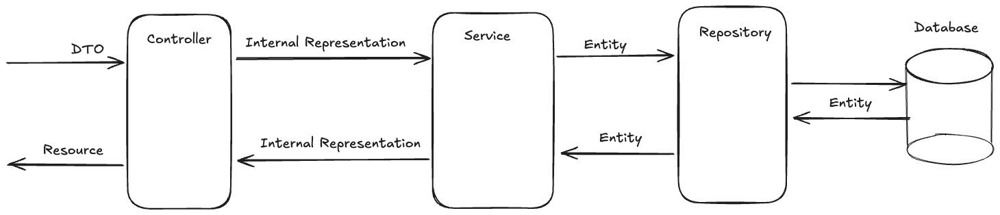
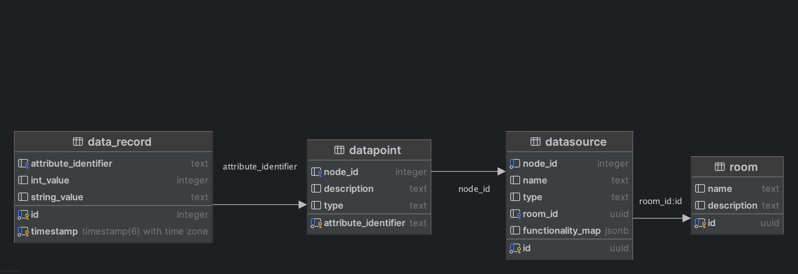

## SVE Exercise 2: Microprofile
Manuel Seifriedsberger

### Project Idea

The overall goal of the project is to build a system which connects to Matter enabled smart home devices to read and store data from the devices.
This allows analysis of historic data and custom views and dashboards to be created.  

### Exercise 2: Microprofile

#### Task for exercise 1
The tasks for this exercise were to set up the components of the system and get them running. Furthermore, some initial logic was implemented.
This includes several endpoints to interact with the system in a basic way. The endpoints are described using the Swagger UI reachable at `http://localhost:8080/swagger-ui/index.html`.

Following components were set up:
- TimescaleDB to store the data of the devices
- Matter Server to connect to Matter devices
- Spring Boot application which connects to the TimescaleDB and provides functionality for the user
- Docker and Docker Compose orchestration
- Mechanism to define supported Matter devices and their relevant data and control points using YAML config files

As I plan on implementing the connection to the Matter Server in a future exercise, there is no real data being used so far. However, the workflows are somewhat accurately implemented.

`Matter Service.postman_collection.json` contains the Postman collection to test the endpoints of the application. The collection is also available in the `postman` folder.

#### Application Architecture

The application architecture follows this design:
<<<<<<< HEAD
<<<<<<< HEAD

=======

>>>>>>> 793a706 (Readme of last exercise)
=======

>>>>>>> c0edf42 (updated image refs in readme)

##### Components:
- **Controller**: The controller is the entry point for the user and holds no logic. It receives the request and forwards it to the service.
- **Service**: The service contains the business logic of the application.
- **Repository**: The repository is responsible for the data access.
- **Database**: The database is where the data is stored. In this case, TimescaleDB is used to store the data.

##### Models:
- **DTO** refers to a Data Transfer Object which is sent to the API by the user.
- The **Internal Representation** is how the data is internally represented in the application.
- **Entity** refers to the database entity which is used to store the data in the database.
- And a **Resource** is the representation of the data shown to the user.

#### Database

The database used in this project is TimescaleDB. TimescaleDB is a time-series database which is built on top of PostgreSQL. It is designed to handle large amounts of time-series data and provides features such as compression, continuous aggregates, and more.
The schema of the database looks like this:

The **data_record** table is a Timescale hypertable and stores the readings from the devices. Devices are stored as **datasources**.

##### Migration Management
The migration management is done using Flyway. Flyway is a database migration tool which allows to manage the database schema and data. It is used to create the initial schema and to manage the migrations.
Migrations are put into the `src/main/resources/db/migration` folder and are automatically applied when the application is started. The migrations are written in SQL and are executed in order.

#### Matter Device Configs
The Matter devices are defined using YAML config files. The config files are used to define the supported Matter device types. 
A config also defines which data of said device type is relevant and needs to be stored in the database in the form of `datapoints`. Furthermore, it also provides a definition of `controlpoints` which define how one is able to interact with a device.
The config files are stored in the `src/main/resources/matter-device-configs` folder.
The naming follows the defined identifier of the device type defined in the Matter specification.

<<<<<<< HEAD
When a device is commissioned the available configs are checked if the device is supported by the system.
=======
When a device is commissioned the available configs are checked if the device is supported by the system. 
>>>>>>> 793a706 (Readme of last exercise)

### Lessons Learned

- The docker setting "network-mode: host" is not supported on MacOs or on Windows. This means that the Matter server is not able to discover devices in the network and therefore is not able to connect to them. The solution is to use a Linux machine.
- The usage of different `application.properties` files for different environments is already needed if the application is run locally during development and also inside a docker container as the connection to the other components is different.
- The overhead of using different models and data representations might currently not be needed. However, it already allows to easily change how the data is represented in each layer and allows to specifically control what data the user is able to see. 
- Putting the application inside the `docker-compose` file might not be a good idea during development as a `docker compose up -d` command also starts the application which one might not want.
