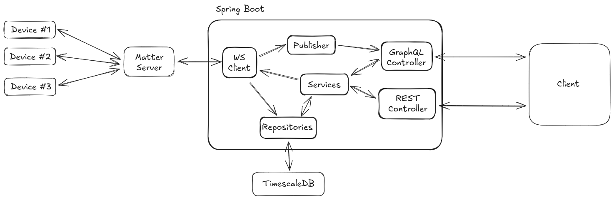

## SVE Exercise 3
Manuel Seifriedsberger

### Project Idea

The overall goal of the project is to build a system which connects to Matter enabled smart home devices to read and store data from the devices.
This allows analysis of historic data and custom views and dashboards to be created.  

### Exercise 3: Web Services

#### Task for exercise 3:
The task for this exercise was to implement GraphQL
- Queries (for the existing endpoints and also to query the device data)
- Subscriptions (for live updates of the devices)

#### Queries

Two queries were implemented: One Top-Level query to be able to query all data in one go: 
```
rooms: [Room!]!
```

An example of this query could look like this:

```graphql
query {
    rooms {
        id
        name
        description
        devices {
          id
          name
          type
          datapoints {
            attributePath
            description
          }
        }
  }
}
```


As the structs of the schema leads to N + 1 select problems, they were addressed using the provided `@BatchMapping` functionality.
This was implemented for `devices` and `datapoints`.
Below is an example resolver for the devices. It gets the List of the RoomResource it needs to query and returns the Map of a Room to all its devices.
Following the architecture of the last exercise, the controllers were held lightweight with the main work being done by the corresponding service.
<<<<<<< HEAD

```java
    @BatchMapping(typeName = "Room", field = "devices")
    public Map<RoomResource, List<DeviceResource>> devices(List<RoomResource> rooms) {
        // ...
        var groupedDatasources = datasourceService.getDatasourcesGroupedByRoomIds(roomIds);
        // ...
    }
```

The service receives a List of `roomIds` and gets the corresponding `Device`s / `Datasource`s

```java
public Map<UUID, List<Datasource>> getDatasourcesGroupedByRoomIds(List<UUID> roomIds) {
    ...
}
```


This also applies to the `Datapoints` resolver.

This query also allows to directly load the data of the device, either on device level or on datapoint level (or both). The query allows filtering of the data by defining a `from` and/or a `to` date.

```graphql
query {
    rooms {
        devices {
          name
          data(from:"2025-05-20T14:09:36.964+02:00") {
            deviceId
            attributePath
            numericValue
            timestamp
          }
          datapoints {
            description
            data(to:"2025-05-20T14:09:36.964+02:00") {
              deviceId
              attributePath
              numericValue
              timestamp
            }
          }
        }
  }
}
```

Another query was implemented to be able to query the data of the devices by device or by datapoint with filtering options for the date:
```
deviceData(deviceId: ID, datapointId: ID, from: DateTime, to: DateTime): [DeviceData!]!
```


#### Subscriptions

It is possible to subscribe on `DeviceData` per Device or per Datapoint. When subscribing on Device-Updates, Data for all Datapoints is returned.
```
onDeviceData(deviceId: ID): DeviceData
onDatapointData(datapointId: ID): DeviceData
```

The subscriptions were tested using the [Altair GraphQL CLient](https://altairgraphql.dev/).

An example subscription looks like this:
```graphql
subscription OnDatapointData {
    onDatapointData(datapointId: "394e4827-ffbe-4449-be98-1f6a400272dc") {
        deviceId
        attributePath
        stringValue
        numericValue
        timestamp
        unitOfMeasurement
    }
}
```


To be able to work with subscriptions, the Spring Reactor framework was used. Clients can subscribe to either a `DevieID` or a `DatapointID`. The subscriptions are managed inside the `DeviceDataPublisher`.

```java
    private final Map<UUID, Sinks.Many<DataRecord>> deviceSinkMap = new ConcurrentHashMap<>();
    private final Map<UUID, Sinks.Many<DataRecord>> datapointSinkMap = new ConcurrentHashMap<>();
```
When new data is available, it gets published to the corresponding "topic". 
```java
this.deviceDataPublisher.publishForDevice(datasource.getId(), data);
this.deviceDataPublisher.publishForDatapoint(dp.getId(), data);
```

The `DeviceDataPublisher` then gets the corresponding sink and emits the record to its subscribers.
```java
public void publishForDevice(UUID deviceId, DataRecord record) {
    var sink = deviceSinkMap.get(deviceId);
    if (sink != null) {
        sink.tryEmitNext(record);
    }
}
```

When subscribing to the updates, the `Sink` is initially created and 
```java
public Flux<DataRecord> subscribeToDevice(UUID deviceId) {
    return deviceSinkMap
            .computeIfAbsent(deviceId, id -> Sinks.many().multicast().onBackpressureBuffer())
            .asFlux();
}
```

#### Matter Server

Part of this exercise also included getting access to real device data. Therefore, a Websocket-Client was implemented to communicate with the `Matter-Server`. Communication works asynchronous using WebSockets. 
The client subscribes on a `onMessage` method where data is handled accordingly, e.g. written to the database and published to the subscribers.
To interact with the Matter-Server, defined commands can also be sent using the already established Websocket connection.

Currently, the implementation of the `MatterServer-Client` focuses on providing the necessary means to add devices and poll them for their data.

The current workflow is to first commission a device by providing the Matter-Commission code in the REST-endpoint. This endpoint is also work in progress and currently returns a Internal Server Error even though it works.
When the device was commissioned successfully, it is written to the database. By querying the database for the devices (REST or GraphQL), one is able to retrieve the DeviceID.
Using the DeviceID, subscribing to data updates is possible. Currently, the only way to get the data is by polling. Therefore, the corresponding REST endpoint (`/api/data/poll/{deviceID}`) needs to be called.




Above figure depicts the components which can currently be distinguished and how they interact with each other:
- **REST Controller**: Accepts REST requests from the Client and forwards them to the corresponding Service
- **GraphQL Controller**: Handles GraphQL queries and subscriptions, mappings to the schema and batching. Also forwards the request to the services
- **Services**: Are the main business logic. Services send commands to the Matter Server using the Websocket Client and write and read from the repositories and manage the config files for the supported Matter Devices.
- **Repositories**: Handle access to the database
- **WebSocket Client**: Establishes a communication with the Matter Server, sends commands to it (e.g. commissioning of a device) and listens for messages and handles them (e.g. writing data to the DB and publishing it)
- **Publisher**: Acts as an intermediary for the GraphQL Subscriptions and handles the subscriptions. 


### Lessons Learned

- With enough knowledge of GraphQL, it might be beneficial to utilize the `BatchMapping` capabilities from the beginning
- Batching also is tricky when using arguments. I tried to also batch the data queries inside the room query, but did not manage to find a way to replace the `from` and `to` arguments
- Finding a good, clean and easily understandable architecture becomes increasingly difficult with both REST and GraphQL endpoints and synchronous and asynchronous parts of the service.

- Subscriptions were actually easier to implement than expected but might become more difficult with increasing project complexity
